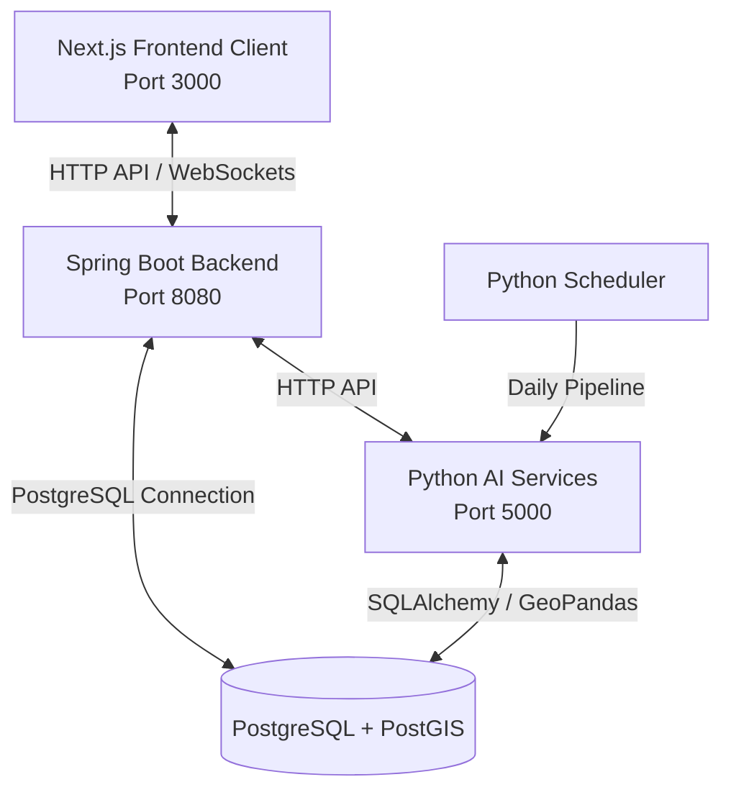

# TÀI LIỆU TỔNG QUAN DỰ ÁN GUARDSBATXAT
*(Hệ thống hỗ trợ cứu hộ & Phòng chống thiên tai Bát Xát - Lào Cai)*

Hệ thống **GuardBatXat** là một nền tảng tích hợp công nghệ không gian (**WebGIS/PostGIS**) và Trí tuệ nhân tạo (**AI/ML**) để hỗ trợ giám sát, dự báo thiên tai (sạt lở, ngập lụt), định tuyến đường đi cứu hộ an toàn và quản lý điều phối tác chiến khẩn cấp tại huyện Bát Xát, tỉnh Lào Cai.

---

## 1. KIẾN TRÚC HỆ THỐNG (SYSTEM ARCHITECTURE)

Hệ thống được thiết kế theo kiến trúc 3 phân hệ độc lập, giao tiếp với nhau qua **REST APIs** và kết nối thời gian thực qua **WebSockets**:



### 1.1. Phân hệ Backend (Spring Boot 3.2.4)
*   **Vị trí:** `e:\NCKH\BatXat`
*   **Vai trò:** Nghiệp vụ lõi (Core Business Logic), xác thực & phân quyền người dùng (JWT), quản lý dữ liệu, đồng bộ hóa thời gian thực thông qua WebSockets (thông báo khẩn cấp, cập nhật vị trí trực tiếp).
*   **Công nghệ chủ đạo:** Java 17, Spring Boot, Spring Security, Spring Data JPA, Hibernate Spatial (truy vấn địa lý không gian), WebSockets (STOMP), Redis.

### 1.2. Phân hệ Frontend (Next.js 16.2.1)
*   **Vị trí:** `e:\NCKH\BatXat-Client`
*   **Vai trò:** Giao diện WebGIS tương tác trực quan cho 4 phân quyền (Citizen, Rescue, Commander, Admin).
*   **Công nghệ chủ đạo:** Next.js, React, TailwindCSS, Leaflet / Mapbox (Bản đồ số).

### 1.3. Phân hệ AI & Spatial Services (Python 3.10)
*   **Vị trí:** `e:\NCKH\GuardBaXat\Spatial-Intelligence`
*   **Vai trò:** Thu thập dữ liệu thời tiết/thủy văn tự động; chạy mô hình học máy kép (LSTM & Random Forest) dự báo rủi ro ngập lụt, sạt lở; xây dựng đồ thị mạng lưới giao thông MCDM (AHP Weighting) để định tuyến an toàn.
*   **Công nghệ chủ đạo:** Flask, GeoPandas, Shapely, OSMnx, NetworkX, PyTorch, Keras, Scikit-Learn.

---

## 2. CƠ SỞ DỮ LIỆU ĐỊA LÝ (POSTGIS DATABASE SCHEMA)

Hệ thống sử dụng **PostgreSQL** kết hợp extension **PostGIS** để lưu trữ và xử lý truy vấn không gian phức tạp:

### 2.1. Bảng lưu trữ mạng lưới giao thông & Hạ tầng
*   `batxat_road_nodes`: Chứa tọa độ các giao lộ đường bộ (`geom`).
*   `batxat_road_edges`: Chứa các cạnh đường đi kèm tọa độ PostGIS (`geom`), chiều dài (`length_m`), độ dốc trung bình (`avg_slope`), độ cao trung bình (`avg_elevation`), hạng đường (`road_capacity`), trạng thái cầu (`is_bridge`), báo cáo ách tắc từ cộng đồng (`community_report`), và chi phí định tuyến được tính toán (`cost_safety`, `cost_speed`).
*   `batxat_buildings`: Lưu trữ thông tin nhà dân (tọa độ hình học `geom`, cao độ `elevation_z`, khoảng cách tới nguồn nước `dist_to_water`, hệ số thảm phủ `landcover`, độ dốc nền `slope`, xác suất sạt lở AI dự đoán `landslide_prob`).
*   `batxat_safe_havens`: Vị trí điểm sơ tán an toàn (trường học, trạm y tế vùng cao) kèm thuộc tính sức chứa tối đa và số lượng người đang cư trú thực tế.

### 2.2. Bảng phục vụ tác chiến & AI
*   `users` & `user_profiles`: Thông tin tài khoản và "Hồ sơ sinh tồn" (nhóm máu, biết bơi, bệnh nền, vật dụng khẩn cấp).
*   `sos_requests` & `sos_update_logs`: Tín hiệu SOS khẩn cấp (GPS, số người, tình trạng y tế) và tiến độ giải cứu thực địa theo thời gian thực.
*   `incident_reports`: Tin báo từ cộng đồng về các điểm sạt lở, ngập hoặc sập cầu.
*   `batxat_daily_risk`: Kết quả dự báo rủi ro ngập lụt, sạt lở và cấp độ cảnh báo theo ngày.
*   `batxat_ahp_weights`: Trọng số so sánh cặp (AHP) cho hai chiến lược tìm đường (An toàn - Cứu hộ).
*   `batxat_model_registry`: Quản lý các phiên bản mô hình AI (đường dẫn mô hình, độ chính xác, trạng thái hoạt động).

---

## 3. PHÂN TÍCH NGHIỆP VỤ CHI TIẾT THEO PHÂN QUYỀN (ROLES & FEATURES)

### 3.1. Người dân (Role: CITIZEN)
*   **Bản đồ Cảnh báo (Citizen Heatmap):** Bản đồ nhiệt trực quan (Đỏ/Cam/Vàng) thể hiện vùng nguy hiểm mà không hiển thị các thông số phức tạp nhằm tránh gây rối mắt trong tình trạng khẩn cấp.
*   **Kiểm tra An toàn (Safety Check):** Click chọn một vị trí ngẫu nhiên trên bản đồ để AI kiểm định mức độ rủi ro sạt lở dựa trên dữ liệu độ dốc nền và lượng mưa thực tế.
*   **Định tuyến An toàn (Safe Routing):** Tìm đường từ A đến B sử dụng thuật toán MCDM để né tránh hoàn toàn các khu vực ngập úng hoặc nguy cơ sạt lở cao.
*   **Tìm Nơi Trú Ẩn (Safe Shelter):** Đề xuất 3 địa điểm sơ tán an toàn gần nhất nằm ngoài vùng rủi ro, vạch sẵn lộ trình đến nơi trú ẩn.
*   **Phát SOS & Hồ sơ sinh tồn:** Gửi thông tin định vị chính xác kèm hồ sơ sinh tồn cá nhân (ví dụ: cần mang theo thuốc đặc trị, ưu tiên xuồng vì không biết bơi).

### 3.2. Đội Cứu Hộ (Role: RESCUE)
*   **Tiếp nhận SOS:** Theo dõi bảng điều khiển SOS sắp xếp theo thứ tự ưu tiên (VD: người bị thương lên đầu). Bấm "Nhận" để chuyển trạng thái sang "Đang xử lý".
*   **Nhật ký Hiện trường (Field Updates):** Cập nhật tiến độ thực tế (ví dụ: "Đang dọn cây đổ" -> "Đã tiếp cận nạn nhân" -> "Đã đưa về trạm xá") giúp trung tâm chỉ huy nắm bắt tức thời.
*   **Báo cáo Vị trí trực tiếp (Live Location):** Thiết bị di động của đội cứu hộ tự động truyền tọa độ GPS liên tục qua WebSockets về trung tâm để vẽ hành trình cứu hộ thực tế.

### 3.3. Trung tâm Chỉ huy (Role: COMMANDER)
*   **Bản đồ Phân tích Vĩ mô (Commander Heatmap):** Xem chi tiết diện tích ngập lụt ($m^2$), ước tính số lượng tòa nhà và người dân bị ảnh hưởng theo từng kịch bản dâng nước.
*   **Kích hoạt Sơ tán khẩn cấp (Evacuation):** Commander vẽ một vòng tròn khoanh vùng nguy cơ, hệ thống lập tức gửi lệnh qua WebSocket kích nổ chuông cảnh báo lớn trên điện thoại của toàn bộ người dân nằm trong phạm vi ảnh hưởng.
*   **Phát sóng Cảnh báo (Broadcast):** Gửi tin nhắn khẩn cấp (như xả lũ thủy điện) đến toàn hệ thống.

### 3.4. Quản trị viên (Role: ADMIN)
*   **Biên tập Dữ liệu Không Gian:** Vẽ/chỉnh sửa tòa nhà, các cạnh giao thông nền trực tiếp trên bản đồ số.
*   **Quản trị Mô hình AI (Model Registry):** Kích hoạt/thay đổi phiên bản mô hình AI (Landslide/Flood) thời gian thực mà không cần dừng máy chủ.
*   **So sánh Thuật toán (Routing Compare):** Chạy so sánh trực quan giữa 3 chiến lược: Đường ngắn nhất (Dijkstra), Đường an toàn nhất (MCDM Safety) và Đường cứu hộ nhanh nhất (MCDM Speed) để phục vụ xuất số liệu báo cáo khoa học.

---

## 4. LUỒNG XỬ LÝ AI & TỐI ƯU HÓA ĐỊNH TUYẾN (AI SERVICES PIPELINE)

### 4.1. Chu kỳ Chạy ngầm (main_scheduler.py)
Scheduler chạy liên tục mỗi ngày (mặc định lúc 06:00 sáng hoặc cấu hình định kỳ test mỗi 5 phút) để kích hoạt chuỗi tác vụ:
1.  **Thu thập dữ liệu (04_flood_data_fusion.py):** Tổng hợp lượng mưa, độ ẩm đất của các trạm đo ở thượng nguồn (Y Tý, Sàng Ma Sáo), trung nguồn (Trịnh Tường) và hạ nguồn (Bát Xát).
2.  **Dự báo kép (06_integrated_risk_prediction.py):**
    *   **Ngập lụt:** Đưa chuỗi dữ liệu lịch sử vào mô hình **LSTM** để dự đoán lượng nước sông dâng tại hạ nguồn.
    *   **Sạt lở:** Đưa dữ liệu độ dốc nền (soi từ file TIF cao độ DEM 30m), thảm thực vật (soi từ file TIF vệ tinh Dynamic World 10m), lượng mưa tích lũy 3 ngày và độ ẩm đất vào mô hình **Random Forest** để chấm điểm xác suất sạt lở cho hàng ngàn ngôi nhà.
3.  **Lưu kết quả:** Ghi nhận rủi ro dự báo vào `batxat_daily_risk` và cập nhật mực nước hệ thống.
4.  **Cập nhật Đồ thị MCDM (08_ahp_weighting.py):**
    *   Nhận kết quả dự báo thiên tai mới nhất từ cơ sở dữ liệu.
    *   Tính toán ma trận so sánh cặp **AHP** (Analytic Hierarchy Process) để đưa ra các bộ trọng số tiêu chuẩn cho việc định tuyến.
    *   Tính toán lại giá trị chi phí cạnh đường:
        $$\text{Chi phí Ngập lụt} = \text{Rủi ro ngập} \times \left(\frac{1000}{\text{Độ cao đường} + 1}\right)$$
        $$\text{Chi phí Sạt lở} = \text{Rủi ro sạt lở} \times \left(\frac{\text{Độ dốc đường}}{35}\right)$$
        $$\text{Chi phí MCDM} = w_{distance} \cdot \text{Khoảng cách} + w_{flood} \cdot \text{Chi phí Ngập} + w_{landslide} \cdot \text{Chi phí Sạt lở} + \dots$$
    *   Đồng bộ hàng loạt chi phí này ngược lại bảng `batxat_road_edges` bằng cơ chế Bulk Update (bảng tạm `tmp_mcdm_costs`) và lưu trữ vào file GraphML `baxat_mcdm_final.graphml`.

### 4.2. Định tuyến Thời gian thực (app.py)
Khi người dân hoặc nhân viên cứu hộ yêu cầu tìm đường, Spring Boot sẽ chuyển tiếp yêu cầu đến Flask API:
*   Flask sử dụng thư viện **NetworkX** để tìm đường đi ngắn nhất trên đồ thị GraphML dựa theo trọng số `cost_safety` (né tránh vùng ngập/sạt lở tối đa) hoặc `cost_speed` (tối ưu hóa thời gian di chuyển của đội cứu hộ).
*   Đồng thời kết hợp truy vấn PostGIS lấy ra danh sách các tuyến đường đang bị cộng đồng báo cáo tắc nghẽn/ngập sâu thực tế để trả về cảnh báo vẽ đè lên bản đồ.

---

## 5. HƯỚNG DẪN KHỞI CHẠY (DEPLOYMENT GUIDE)

### 5.1. Khởi chạy Database & Redis (Docker)
```bash
docker-compose up -d postgres-db redis
```

### 5.2. Cài đặt & Khởi chạy AI Services (Python)
Cấu hình biến môi trường kết nối database trong file `.env` hoặc trực tiếp trong code, sau đó thực hiện:
```bash
cd Spatial-Intelligence
python -m venv venv
venv\Scripts\activate
pip install -r requirements.txt

# Chạy scheduler thu thập dữ liệu & dự báo AI ngầm
python main_scheduler.py

# Chạy FastAPI Server cung cấp dịch vụ định tuyến (Port 5000)
python module3_api/routing_nearest.py
```

### 5.3. Khởi chạy Backend (Spring Boot)
Cấu hình kết nối cơ sở dữ liệu trong file `src/main/resources/application.properties` hoặc file `.env`:
```properties
SPRING_DATASOURCE_URL=jdbc:postgresql://localhost:5432/GuardBatXat
SPRING_DATASOURCE_USERNAME=postgres
SPRING_DATASOURCE_PASSWORD=your_password
```
Khởi chạy ứng dụng:
```bash
mvnw.cmd spring-boot:run
```

### 5.4. Khởi chạy Frontend (Next.js Client)
```bash
cd BatXat-Client
npm install
npm run dev
```
Truy cập ứng dụng tại `http://localhost:3000`.
